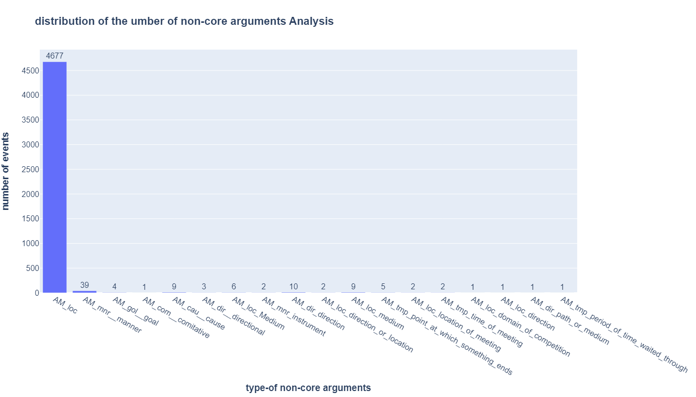
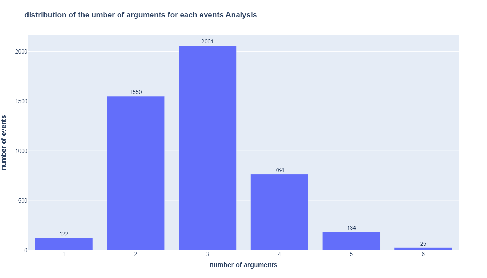

# bootcamp_project
This is a repository for CRDDS Research Data Bootcamp.
The project is called [KAIROS funded by DARPA](https://www.darpa.mil/program/knowledge-directed-artificial-intelligence-reasoning-over-schemas). This repo is just a small part for the project, which mainly offer the ontology for the project.
- ### Overview

In this project, we have several files:

| file_name         | description                                |
|-------------------|--------------------------------------------|
| main.ipynb        | Python Jupyter notebook as the main script |
| template_info.csv | the output generated by our code|
|xpo_v5.3.json      | source data for our project       |
|dwd_templates for json.xlsx|  the pattern spreadsheet to help generate the template_info.csv|
 |data_evaluation.doc| the evaluation of the dataset respect to the interoperable of FAIR principles|  

Our project focuses on the semantic role labeling and template generation. Semantic Role labeling is a subtask in Natural Language processing, which describes the event and participants in the event, which we called 'arguments'.
Like 'Eat', we can consider as a event, and the major arguments are the one who does the 'eat' action(eater) and the thing that is eaten by the 'eater'.
A example for this event is :
> *Mary eats an apple* 

In this example, ***Mary*** is the eater, ***eat*** is the verb(we call it 'trigger', which trigger the 'eat' event), ***apple*** is the thing that is eaten. 

Based on such information, we can generate a template for this event, like 
<A0_eater> eat <A1_the_thing_is_eaten>.
A0 means the agent and A1 means the patient in linguistics.

**Generating the template is our main purpose**

While some arguments may co-occur with a preposition, like ***"cause/reason"***, it may co-occur with ***For***,

like:
> He robbed the millionaire for the money

We will consider ***the money*** is the ***cause/reason***. The file ***dwd templates for json***
offer the different prepositions with different arguments to help us generate the template.

*xpo_v5.3* is the main source data, which can be found in <https://github.com/e-spaulding/xpo>. It includes in total 4706 events.

The file is a json file, each event is identified by an id which starts with   'DWD',  is an id in wikidata called qnode,  there includes much information, but we mainly use the followings
1. **name**: the name for the event
2. **pb_roleset**: the name for the event in the propbank, can be found here: <https://propbank.github.io/>
3. arguments: all the arguments in the event, we mainly use the name and short_name to generate the templates for the events

*template_info.csv* is the output, which is a spreadsheet, it includes 4 column: the qnode, event name, template, and the left arguments that not in the dwd_templates for json and cannot add into the template.

- ### Questions&results
    - the passive events proportion
      - There is some events that there are no A1 in the events, which signifies the events do not include an action doer and the action apply on the other receiver. Like '*wake up*', we cannot find out the receiver in this event, so that we just have a doer and the action here. I just called such events as ***passive events***, in linguistics, it is called avalent verb. We want to know how much does such type of events take up in the total events
        - the passive events is 7.20 %
        - some event examples :scarcity, disease_outbreak, conflagration, merger, mutation, natural_causes, death, disease, symptom, health_problem, abdominal_distention, abdominal_exercise, abdominal_symptom, acarodermatitis, accidental_death, acropustulosis, actinomycosis, adverse_event, affair, aftershock, air_current, air_current, airflow, airprox, alcoholism, animal_disease,  blood_flow, bond,
    - the distribution of non-core arguments
      - there are some arguments are not necessary and not tied to any specific events, and it just encodes some general information, like the location where a event happens and the reason why a event happen, sometimes the non-core arguments can be core-arguments(starts with *AM*), like in the event *escape*, the *location* would be a core argument instead of a non-core argument. We want to know the distribution of such non-core arguments in the events.
        - 
        - we add the location for events on purpose, thus the number of location is the most.
    - the distribution of number of arguments
      - the number of arguments in each event varies a lot, we might want to know the distribution of number of the arguments. This is related to the ***Valency*** in linguistics.
        - (not including the non-core arguments)
        - we can see from teh graph that the 3 arguments most, which involves the agent, patient and the experiencer. which signifies in English, the events involves the 3 participants. In otehr languages, it might just involves two even one participant most. Other participants might signify by the morphological approach  or context rather than a word.